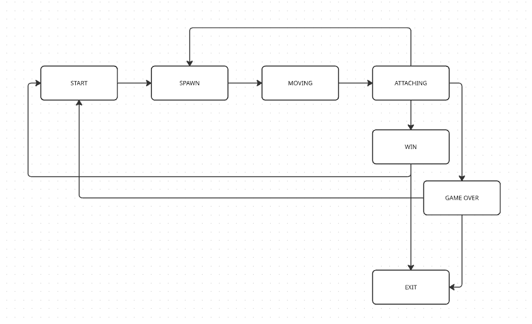
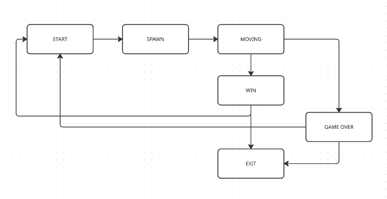

# 🎮 Brick Games - Змейка и Тетрис

Консольная и графическая реализация классических аркадных игр Змейка и Тетрис с использованием ncurses и Qt.

## 📋 Содержание

- [Описание проекта](#описание-проекта)
- [Архитектура MVC](#архитектура-MVC)
- [Конечный автомат](#конечный-автомат)
- [Технологии](#технологии)
- [Структура проекта](#структура-проекта)
- [Установка зависимостей](#установка-зависимостей)
- [Сборка проекта](#сборка-проекта)
- [Запуск игр](#запуск-игр)
- [Управление](#управление)
- [Документация](#документация)
- [Тестирование](#тестирование)

## 📖 Описание проекта

Проект представляет собой реализацию двух классических игр:

- **Змейка** - управление змейкой для сбора яблок
- **Тетрис** - классическая головоломка с падающими фигурами

Поддерживаются два интерфейса:

- Консольный (ncurses)
- Графический (Qt)

## 🏗️ Архитектура MVC

Проект следует архитектурному паттерну **Model-View-Controller (MVC)** для разделения логики игры, представления и управления.

### 📊 Model (Модель)

- **SnakeGame** (`brick_game/snake/snake_model.cc`) - игровая логика Змейки
- **Tetris backend** (`brick_game/tetris/backend.c`) - игровая логика Тетриса
- Хранит состояние игры, правила, обработку движений
- Не зависит от интерфейса отображения

### 👁️ View (Представление)

- **GameView** (`gui/desktop/view.cc`) - графическое отображение Qt
- **Frontend** (`gui/cli/frontend.c`) - консольное отображение ncurses
- Отвечает за визуализацию состояния игры
- Получает данные от контроллера

### 🎮 Controller (Контроллер)

- **GameController** (`brick_game/controller/controller.cc`) - управление Qt интерфейсом
- **Main loop** (`gui/cli/main.c`) - управление консольным интерфейсом
- Обрабатывает пользовательский ввод
- Координирует взаимодействие между Model и View

### 🔄 Поток данных MVC:

1. Пользователь совершает действие (клавиша, клик)
2. Controller получает ввод и передает в Model
3. Model обновляет состояние игры
4. View получает новое состояние и обновляет отображение
5. Цикл повторяется

Эта архитектура позволяет легко поддерживать разные интерфейсы (CLI/GUI) для одной и той же игровой логики.

## 🔄 Конечный автомат (FSM)

Игры используют конечные автоматы для управления состояниями игрового процесса.



_Диаграмма конечного автомата Тетриса показывает переходы между состояниями: Start, Spawn, Moving, Attaching, GameOver, Win, Exit_



_Диаграмма конечного автомата Змейки показывает переходы между состояниями: Start, Spawn, Moving, GameOver, Win, Exit_

### Состояния игры:

- **START** - Начальное состояние
- **SPAWN** - Создание нового элемента (яблоко/фигура)
- **MOVING** - Движение змейки/фигуры
- **ATTACHING** - Соединение фигуры в Тетрисе (фигура становится статичной)
- **GAME_OVER** - Конец игры
- **WIN** - Победа
- **EXIT** - Выход из игры

## ⚙️ Технологии

- **Языки**: C, C++
- **Библиотеки**: ncurses, Qt
- **Сборка**: Make, CMake
- **Документация**: Doxygen
- **Тестирование**: Google Test

## 🗂️ Структура проекта
```
src/
├── brick_game/
│ ├── snake/ # Игра Змейка (C++)
│ │ ├── snake_model.cc
│ │ ├── api.cc
│ │ ├── snake_fsm.cc
│ │ ├── snake.h
│ │ ├── snake_fsm.h
│ │ └── snake_wrapper.h
│ └── tetris/ # Игра Тетрис (C)
│ │ ├── backend.c
│ │ ├── backend.h
│ │ ├── fsm.c
│ │ └── fsm.h
│ └── controller/ # Контроллер
│ │ ├── controller.cc
│ │ └── controller.h
│ └── brick_games.h/ # Структуры и функции из спецификации
├── gui/
│ ├── cli/ # Консольный интерфейс (ncurses)
│ │ ├── frontend.c
│ │ ├── frontend.h
│ │ └── main.c
│ └── desktop/ # Графический интерфейс (Qt)
│ ├── brick_game.pro
│ ├── snake_game.pro
│ ├── tetris_game.pro
│ ├── mainwindow.cc
│ ├── mainwindow.h
│ ├── view.cc
│ ├── view.h
│ └── main.cc
└──── Makefile
```

## 🛠️ Установка зависимостей

### Ubuntu:

```bash
sudo apt-get update
sudo apt-get install -y \
    build-essential \
    libncurses5-dev \
    qt5-qmake \
    qtbase5-dev \
    libgtest-dev \
    doxygen \
    graphviz \
    lcov \
    clang-format
```

## 🔨 Сборка проекта

### Интерактивная сборка:

```bash
make
```

Установит все игры разных версий.

### Сборка конкретной игры:

**Змейка:**

```bash
# Консольная версия
make snake-ncurses

# Графическая версия
make snake-qt
```

**Тетрис:**

```bash
# Консольная версия
make tetris-ncurses

# Графическая версия
make tetris-qt
```

## 🕹️ Запуск игр

### Интерактивное меню:

```bash
make brick-game
```

Напрямую каждую игру

### Консольные версии:

```bash
# Змейка
./build/bin/snake_game_cli

# Тетрис
./build/bin/tetris_game_cli
```

### Графические версии:

```bash
# Змейка
./build/bin/snake_game_qt

# Тетрис
./build/bin/tetris_game_qt
```

## 🎮 Управление

- **↑↓←→** - Управление направлением
- **Enter** - Начать
- **Пробел** - Специальное действие
- **P** - Пауза
- **Esc** - Выход из игры

## 📚 Документация

### Генерация документации:

```bash
make dvi
```

Документация будет доступна в:

- 📖 docs/html/index.html - HTML версия
- 📖 docs/latex/refman.pdf - PDF версия (если установлен LaTeX)


## 🧹 Очистка

### Удаление собранных файлов:

```bash
make clean
```

## 📁 Файлы конфигурации

- **Makefile** - Основной файл сборки
- **Doxyfile** - Конфигурация документации
- **brick_game.pro** - Для графического интерфейса

## 🏆 Рекорды

Рекорды сохраняются в файлах:

- `high_score_sn.txt` - для Змейки
- `high_score_t.txt` - для Тетриса

### Цели Makefile:

- `all` - Сборка игр
- `install` - Установка игр
- `brick_game` - Интерактивное меню запуска игры
- `uninstall` - Удаление игры
- `dvi` - Генерация документации
- `test` - Запуск тестов
- `clean` - Очистка проекта
- `dist` - Архивирование проекта
